<h1 align="center">Hi, I'm Naveen 👋</h1>
<h3 align="center">AI/ML Engineer & Solutions Architect — I design systems for problems most people avoid</h3>

  
  
  
  

---

### 🧭 How I think about my work

I don't just write ML code — I design the **architecture around the problem**: where the bottleneck actually is, what breaks at scale, and what the cheapest correct solution looks like. Whether it's a RAG pipeline that needs to stay cheap in production, a booking backend that can't afford race conditions, or a real-time CV system running on a webcam — my job is to find the *right-sized* solution, not the fanciest one.

- 🏗️ **Systems thinker** — I design for failure modes (race conditions, cost blowups, latency) before I write the first line of model code.
- 🎯 **Full ML lifecycle** — data → embeddings/features → training/orchestration → evaluation → deployment, end to end.
- 💸 **Cost-aware by default** — I default to free-tier, open-weight, and efficient architectures unless there's a real reason not to.
- 🏆 **2× Hackathon Prizewinner** — shipped full products from zero in 30-hour sprints, twice, under real judging pressure.

---

### 🧩 Architecture Highlights

**Cost-Efficient RAG System** — designed a retrieval pipeline (ChromaDB + LangChain + HuggingFace embeddings + Groq LLaMA-3) built explicitly around minimizing per-query cost without sacrificing retrieval quality — not just "a RAG demo," but a cost model for one.
🔗 [github.com/Naveenp7/Cost-Efficient-RAG](https://github.com/Naveenp7/Cost-Efficient-RAG)

**LLM-as-Judge Evaluation Pipeline** — architected an automated evaluation system with explicit bias mitigation for position bias, verbosity bias, and sycophancy — the kind of infrastructure that makes LLM outputs trustworthy enough to ship.
🔗 [github.com/Naveenp7/llm-judge](https://github.com/Naveenp7/llm-judge)

**Movie Seat Manager** — a high-concurrency booking backend (.NET 8, PostgreSQL, Redis) solving double-booking with distributed locking, idempotency keys, and ACID-compliant transactions. Systems design that generalizes directly to e-commerce and SaaS at scale.
🔗 [github.com/Naveenp7/Movie-Seat-Manager](https://github.com/Naveenp7)

**Enterprise RAG Knowledge Assistant** — end-to-end document Q&A pipeline (LangChain, ChromaDB, Sentence Transformers, FastAPI) covering chunking, embedding, retrieval, and prompt orchestration as a deployable service, not a notebook.

**Crowd Detection & Density Estimation** — real-time YOLO-based video analytics for public-safety and smart-city use cases, with configurable alerting — built for production constraints, not just accuracy on a benchmark.
🔗 [github.com/Naveenp7/Crowd-Detection](https://github.com/Naveenp7)

**AI Resume Screener** — BERT-embedding-based semantic matching engine ranking candidates against job descriptions, with a full NLP pipeline for PDF parsing, NER, and skill extraction.

---

### 🛠️ Tech I architect with

**Languages:** Python · JavaScript/TypeScript · SQL · Java · Dart

**ML & AI:** PyTorch · TensorFlow · Keras · Scikit-learn · XGBoost · HuggingFace Transformers · LangChain · NLTK · spaCy

**LLM Engineering:** RAG Pipelines · Prompt Engineering · LLM-as-Judge · Agentic Workflows · GPT · BERT · Claude · Groq

**Backend & Systems:** FastAPI · Flask · Node.js · Express.js · REST API Design · Distributed Locking · Auth Workflows

**Data:** PostgreSQL · Firebase Firestore · Redis · SQLite · Pandas · NumPy · SHAP

**Cloud & DevOps:** Docker · Kubernetes (fundamentals) · Vercel · GCP · Model Deployment

**Frontend:** React.js · Next.js · Tailwind CSS · Flutter/Dart

---

### 🏆 Recognition

- 🥈 **2nd Prize — MATRIX Hackathon** (30-hour), CSE Dept., MES College of Engineering — shipped a complete full-stack product from zero, ahead of 20+ competing teams.
- 🥉 **3rd Prize — KOTECH Tech Hackathon** (July 2025), Qismat Foundation × Kottakkal Municipality.
- 🎓 **Workshop Facilitator (ADTEC Program)** — led a hands-on AI coding workshop for 20+ junior developers on LLM tooling, prompt engineering, and AI-assisted dev workflows.
- ☁️ **Google Cloud Skill Badges** — Docker, Kubernetes, IAM, Cloud Storage, Monitoring; Compute Engine fundamentals.

---

### 📊 GitHub Stats

Auto-generated daily via GitHub Actions (<a href="https://github.com/lowlighter/metrics">lowlighter/metrics</a>) — no third-party uptime dependency.

---

### 📫 Let's build something

Open to **AI/ML Engineer**, **AI Engineer**, and **software architecture-adjacent** roles — anywhere in India or remote. If you're solving a hard retrieval, evaluation, or systems-design problem, I'd love to hear about it.

📧 **naveensanthosh830@gmail.com** · 🔗 **[LinkedIn](https://linkedin.com/in/naveen-p-42bb1a256)** · 🌐 **[Portfolio](https://naveenp7.vercel.app)**

<i>English (Professional) · Malayalam (Native) · Hindi & Tamil (Conversational)</i>

