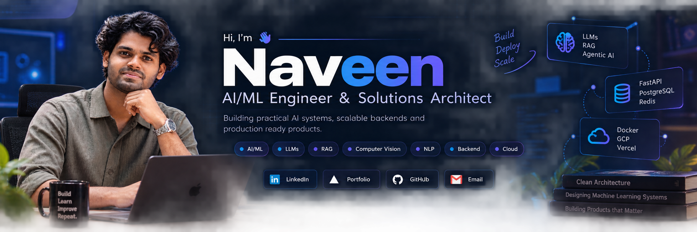

<!-- ========================================================= -->
<!--                       HERO SECTION                        -->
<!-- ========================================================= -->

<div align="center">



</div>

<div align="center">


<br/>

<p>
  <a href="https://linkedin.com/in/naveen-p-42bb1a256">
    
  </a>

  <a href="https://naveenp7.vercel.app">
    
  </a>

  <a href="https://github.com/Naveenp7">
    
  </a>

  <a href="mailto:naveensanthosh830@gmail.com">
    
  </a>
</p>

</div>

<br/>

## 📊 GitHub Activity

<div align="center">


<sub>Contribution activity · updated automatically</sub>

</div>

<!-- ========================================================= -->
<!--                       INTRODUCTION                        -->
<!-- ========================================================= -->

## 👋 About Me

I'm **Naveen**, an **AI/ML Engineer & Solutions Architect** focused on turning difficult technical problems into practical, scalable systems.

I work across the stack — from **ML/LLM pipelines and retrieval systems** to **backend architecture, databases, cloud infrastructure, and production deployment**.

```text
AI / ML
   ↓
LLMs · RAG · Computer Vision · NLP · Evaluation
   ↓
Backend Systems
   ↓
FastAPI · APIs · Databases · Redis · Distributed Systems
   ↓
Production
   ↓
Docker · GCP · Vercel · CI/CD · Cost Optimization
````

> I care less about using the fanciest technology and more about building the **right-sized system for the problem**.

---

## ⚙️ What I Build

<table>
<tr>
<td width="50%" valign="top">

### 🤖 AI & LLM Systems

* RAG pipelines
* LLM evaluation
* Agentic workflows
* Prompt engineering
* Semantic search
* NLP systems
* Computer vision
* AI-powered SaaS

</td>

<td width="50%" valign="top">

### 🏗️ Production Systems

* REST APIs
* Distributed systems
* High-concurrency backends
* Authentication & authorization
* PostgreSQL / Redis architectures
* Cloud deployments
* Cost-efficient infrastructure
* Scalable application design

</td>
</tr>
</table>

---

## 🚀 Selected Engineering Work

### 01 · Cost-Efficient RAG

A production-oriented retrieval system designed around **retrieval quality, inference cost, and deployment simplicity**.

**Stack:** `Python` `LangChain` `ChromaDB` `HuggingFace` `Groq` `LLaMA`

→ [View Repository](https://github.com/Naveenp7/Cost-Efficient-RAG)

---

### 02 · LLM-as-Judge

An automated LLM evaluation pipeline designed to identify and reduce common evaluation problems such as **position bias, verbosity bias, and sycophancy**.

**Stack:** `Python` `LLMs` `Evaluation` `Prompt Engineering`

→ [View Repository](https://github.com/Naveenp7/llm-judge)

---

### 03 · Movie Seat Manager

A high-concurrency booking backend designed to prevent **double booking** using distributed locking, idempotency, transactions, and Redis.

**Stack:** `.NET 8` `PostgreSQL` `Redis` `Distributed Locking`

→ [View Repository](https://github.com/Naveenp7/Movie-Seat-Manager)

---

### 04 · Crowd Detection

Real-time computer vision pipeline for detecting and analysing crowd density from video streams.

**Stack:** `Python` `YOLO` `OpenCV` `Computer Vision`

→ [View Repository](https://github.com/Naveenp7/Crowd-Detection)

---

### 05 · Enterprise RAG Assistant

End-to-end document intelligence pipeline covering document processing, chunking, embeddings, retrieval, and LLM response generation.

**Stack:** `FastAPI` `LangChain` `ChromaDB` `Sentence Transformers`

---

## 🧠 Engineering Principles

<table>
<tr>
<td align="center" width="25%">

### 🏗️

**Design First**

Architecture before implementation.

</td>

<td align="center" width="25%">

### ⚡

**Performance**

Latency and reliability matter.

</td>

<td align="center" width="25%">

### 💸

**Cost Aware**

Efficient systems beat unnecessary complexity.

</td>

<td align="center" width="25%">

### 🔐

**Production Ready**

Security, failure modes and maintainability matter.

</td>
</tr>
</table>

---

## 🛠️ Technology Stack

### Languages

<p>

</p>

### AI / Machine Learning

<p>

</p>

`Scikit-learn` · `XGBoost` · `HuggingFace` · `Transformers` · `LangChain` · `OpenCV` · `spaCy` · `NLTK`

### LLM Engineering

`RAG` · `Agentic AI` · `LLM Evaluation` · `Prompt Engineering` · `Embeddings` · `Vector Search`

### Backend & Data

<p>

</p>

### Frontend & Mobile

<p>

</p>

### Cloud & DevOps

<p>

</p>

---


---

## 🏆 Recognition

<table>
<tr>
<td>

🥈 **2nd Prize — MATRIX Hackathon**
30-hour hackathon · MES College of Engineering

</td>
<td>

🥉 **3rd Prize — KOTECH Tech Hackathon**
Qismat Foundation × Kottakkal Municipality

</td>
</tr>

<tr>
<td>

🎓 **Workshop Facilitator**
AI / LLM tooling workshop for 20+ developers

</td>
<td>

☁️ **Google Cloud Skill Badges**
Docker · Kubernetes · IAM · Storage · Monitoring

</td>
</tr>
</table>

---

## 📌 Currently

```text
Building      → AI-powered products & intelligent systems
Exploring     → Agentic AI · LLM evaluation · scalable AI infrastructure
Interested in → AI/ML Engineering · AI Engineering · Systems Architecture
```

---

## 📫 Let's Connect

<div align="center">

If you're building something interesting around **AI, ML, LLMs, or scalable software systems**, feel free to reach out.

<br/>

<a href="https://naveenp7.vercel.app">
  
</a>

<a href="https://linkedin.com/in/naveen-p-42bb1a256">
  
</a>

<a href="mailto:naveensanthosh830@gmail.com">
  
</a>

<br/><br/>

**[naveensanthosh830@gmail.com](mailto:naveensanthosh830@gmail.com)**

<br/><br/>

<sub>AI/ML Engineer · Solutions Architect · Builder</sub>

</div>
